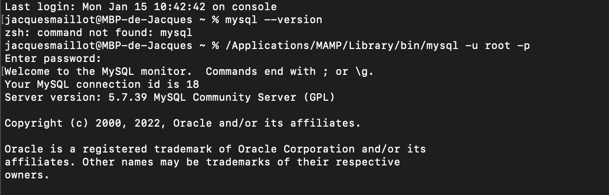

<h1 align=center>
les bases de données SQL
</h1>

## définition : 

SQL (sigle pour Structured Query Language, « langage de requêtes structurées ») est un langage informatique normalisé servant à exploiter des bases de données relationnelles. La partie langage de manipulation des données de SQL permet de rechercher, d'ajouter, de modifier ou de supprimer des données dans les bases de données relationnelles.

on utilise un SGBD (systeme de gestion de base de données) pour manipuler des bases de données.

## LE SGBD

le systeme de gestion de bse de données pour SQL s'apelle mysql. pour connaitre la version de mysql
il faut ecrire le code suivant dans une CMD (console) : 

```
mysql --version
```

nous obtenons ce resultat : 



pour utiliser mysql dans notre CMD il faudrait ecrire le code suivant :

```
mysql -u root -p
```


nous sommes pret à taper du code SQL.

# création de notre premiere base de données.

pour creer ma base de donnée via le CMD nous ecrivons le code suivant :


CREATE DATABASE toujours en MAJUSCULE car se sont des mots réservés mysql, pour nommer notre base de données on choisira les minuscules et finir chauqe instruction pare un point virgule (;)

# création de notre seconde base de données.


# afficher les bases de données 


Voici comment lister les bases de données MySQL avec la commande SHOW DATABASE

# selectionner de données pour son utilisation 


# création de notre premier tableau de base de données.


ALTER TABLE clients_vehicule (
    -> clients_id INT,
    -> vehicule_id INT,
    -> FOREIGN KEY (clients_id) REFERENCES clients(id),
    -> FOREIGN KEY (vehicule_id) REFERENCES vehicule(id)
    -> );

CREATE TABLE vehicules_clients (
    vehicule_id INT NOT NULL ,
    client_id INT NOT NULL,
    FOREIGN KEY (vehicule_id) REFERENCES vehicules(id),
    FOREIGN KEY (client_id) REFERENCES clients(id)
);


-------------------------------------------------------------------------------------------------

Windows PowerShell
Copyright (C) Microsoft Corporation. Tous droits réservés.

Installez la dernière version de PowerShell pour de nouvelles fonctionnalités et améliorations ! https://aka.ms/PSWindows

PS C:\Users\arand\Desktop> mysql -u root -p
Enter password:
Welcome to the MySQL monitor.  Commands end with ; or \g.
Your MySQL connection id is 9
Server version: 8.0.31 MySQL Community Server - GPL

Copyright (c) 2000, 2022, Oracle and/or its affiliates.

Oracle is a registered trademark of Oracle Corporation and/or its
affiliates. Other names may be trademarks of their respective
owners.

Type 'help;' or '\h' for help. Type '\c' to clear the current input statement.

mysql> SOW DATABASES;
ERROR 1064 (42000): Erreur de syntaxe près de 'SOW DATABASES' à la ligne 1
mysql> SHOW DATABASES;
+--------------------+
| Database           |
+--------------------+
| cars               |
| information_schema |
| introdonnes        |
| mysql              |
| performance_schema |
| sys                |
+--------------------+
6 rows in set (0.05 sec)

mysql> SHOW cras
    -> SHOW cars
    -> SHOW DATABASES cars
    -> SHOW DATABASES LIKE 'cars';
ERROR 1064 (42000): Erreur de syntaxe près de 'cras
SHOW cars
SHOW DATABASES cars
SHOW DATABASES LIKE 'cars'' à la ligne 1
mysql> SHOW TABLE vehicule FROM cars;
ERROR 1064 (42000): Erreur de syntaxe près de 'vehicule FROM cars' à la ligne 1
mysql> SHOW TABLE vehicules FROM DATABASE 'cars';
ERROR 1064 (42000): Erreur de syntaxe près de 'vehicules FROM DATABASE 'cars'' à la ligne 1
mysql> USE vehicules;
ERROR 1049 (42000): Base 'vehicules' inconnue
mysql> USE cars;
Database changed
mysql> CREATE DATABASE cars_database;
Query OK, 1 row affected (0.01 sec)

mysql> USE cars_database;
Database changed
mysql> CREATE TABLE vehicules (
    id INTEGER NOT NULL AUTO_INCREMENT PRIMARY KEY,
    marque VARCHAR(100),
    couleur VARCHAR(100),
    prix INTEGER NOT NULL
    );
Query OK, 0 rows affected (0.01 sec)

mysql> "INSERT INTO Clients(Nom,Prenom,Adresse,Ville,Codepostal,Pays,Mail)
    ">
    "> INSERT INTO vehicules(marque,couleur,prix)VALUES('Cupra','Violet',40000),('Toyota CHR','Bleu Klein', 20000),('Wolksvagen','Noir', 27000)
    "> INSERT INTO vehicules(marque,couleur,prix)VALUES('Cupra','Violet',40000),('Toyota CHR','Bleu Klein', 20000),('Wolksvagen','Noir', 27000);
    "> SHOW TABLE vehicules;
    "> SHOW TABLE vehicules FROM cars_database;
    "> SELECT * FROM vehicules;
    "> INSERT INTO vehicules(marque,couleur,prix) VALUES
    "> ('Cupra','Violet',40000),
    "> ('Toyota CHR','Bleu Klein', 20000),
    "> ('Wolksvagen','Noir', 27000);
    ">
    "> ^C
mysql> INSERT INTO vehicules(marque, couleur, prix) VALUES
    ('Cupra','Violet',40000),
    ('Toyota CHR','Bleu Klein', 20000),
    ('Wolksvagen','Noir', 27000);
    INSERT INTO vehicules(marque, couleur, prix) VALUES
    ('Wolksvagen Cabriolet','Violet',50000),
    ('Bentley','Taupe', 60000),
    ('Mercedes','Métallique', 37000);
Query OK, 3 rows affected (0.00 sec)
Enregistrements: 3  Doublons: 0  Avertissements: 0

mysql> SELECT * FROM vehicules;
+----+------------+------------+-------+
| id | marque     | couleur    | prix  |
+----+------------+------------+-------+
|  1 | Cupra      | Violet     | 40000 |
|  2 | Toyota CHR | Bleu Klein | 20000 |
|  3 | Wolksvagen | Noir       | 27000 |
+----+------------+------------+-------+
3 rows in set (0.00 sec)

mysql> CREATE TABLE clients (
    -> id INTEGER NOT NULL AUTO_INCREMENT PRIMARY KEY,
    -> prenom,
    -> nom,
    -> age
    -> );
ERROR 1064 (42000): Erreur de syntaxe près de ',
nom,
age
)' à la ligne 3
mysql> ^C
mysql> CREATE TABLE clients (
    ->  id INTEGER NOT NULL AUTO_INCREMENT PRIMARY KEY,
    -> prenom VARCHAR(100),
    -> nom VARCHAR(100),
    -> age INTEGER NOT NULL
    -> );
Query OK, 0 rows affected (0.04 sec)

mysql>  INSERT INTO clients(prenom, nom, age) VALUES
    -> ('Jonathan', 'Rose', 21),
    -> ('Vivien', 'Lacqué', 24),
    -> ('Sonia', 'Tavares', 25);
Query OK, 3 rows affected (0.00 sec)
Enregistrements: 3  Doublons: 0  Avertissements: 0

mysql> SELECT * FROM clients;
+----+----------+---------+-----+
| id | prenom   | nom     | age |
+----+----------+---------+-----+
|  1 | Jonathan | Rose    |  21 |
|  2 | Vivien   | Lacqué  |  24 |
|  3 | Sonia    | Tavares |  25 |
+----+----------+---------+-----+
3 rows in set (0.00 sec)

mysql> CREATE TABLE client_vehicule (
    ->     client_id INT,
    ->     vehicule_id INT,
    ->     PRIMARY KEY (client_id),
    ->     FOREIGN KEY (client_id) REFERENCES clients(id),
    ->     FOREIGN KEY (vehicule_id) REFERENCES vehicule(id)
    -> );
Query OK, 0 rows affected (0.01 sec)

mysql> CREATE TABLE client_vehicule (
    ->     client_id INT,
    ->     vehicule_id INT,
    ->     PRIMARY KEY (client_id),
    ->     FOREIGN KEY (client_id) REFERENCES clients(id),
    ->     PRIMARY KEY (client_id)^C
mysql> CREATE TABLE client_vehicule (
    ->     client_id INT,
    ->     vehicule_id INT,
    ->     PRIMARY KEY (client_id),
    ->     FOREIGN KEY (client_id) REFERENCES clients(id),
    -> ^C
mysql> CREATE TABLE clients_vehicule (
    -> clients_id INT,
    -> vehicule_id INT,
    -> PRIMARY KEY (client_id),
    -> FOREIGN KEY (client_id) REFERENCES clients(id),
    -> FOREIGN KEY (vehicule_id) REFERENCES vehicule(id)
    -> );
ERROR 1072 (42000): La clé 'client_id' n'existe pas dans la table
mysql>  CREATE TABLE clients_vehicule (
    ->     -> clients_id INT,
    ->     -> vehicule_id INT,
    ->     -> PRIMARY KEY (client_id),
    ->     -> FOREIGN KEY (client_id) REFERENCES clients(id),
    ->     -> FOREIGN KEY (vehicule_id) REFERENCES vehicule(id)
    ->     -> FOREIGN KEY (vehicule_id) REFERENCES vehicule(id)
    -> ^C
mysql> CREATE TABLE clients_vehicule (
    -> clients_id INT,
    -> vehicule_id INT,
    -> PRIMARY KEY (clients_id),
    -> FOREIGN KEY (clients_id) REFERENCES clients(id),
    -> FOREIGN KEY (vehicule_id) REFERENCES vehicule(id)
    -> );
Query OK, 0 rows affected (0.04 sec)

mysql> SELECT * FROM clients_vehicule;
Empty set (0.00 sec)

mysql> DESC clients_vehicule;
+-------------+------+------+-----+---------+-------+
| Field       | Type | Null | Key | Default | Extra |
+-------------+------+------+-----+---------+-------+
| clients_id  | int  | NO   | PRI | NULL    |       |
| vehicule_id | int  | YES  | MUL | NULL    |       |
+-------------+------+------+-----+---------+-------+
2 rows in set (0.01 sec)

mysql> CREATE TABLE clients_vehicule (
    -> clients_id INT,
    -> vehicule_id INT,
    -> FOREIGN KEY (clients_id) REFERENCES clients(id),
    -> FOREIGN KEY (vehicule_id) REFERENCES vehicule(id)
    -> );
ERROR 1050 (42S01): La table 'clients_vehicule' existe déjà
mysql> ALTER TABLE clients_vehicule (
    ->     -> clients_id INT,
    ->     -> vehicule_id INT,
    ->     -> FOREIGN KEY (clients_id) REFERENCES clients(id),
    ->     -> FOREIGN KEY (vehicule_id) REFERENCES vehicule(id)
    ->     -> );
ERROR 1064 (42000): Erreur de syntaxe près de '(
    -> clients_id INT,
    -> vehicule_id INT,
    -> FOREIGN KEY (clients_id)' à la ligne 1
mysql> ALTER TABLE clients_vehicule (
    -> clients_id INT,
    -> vehicule_id INT,
    -> FOREIGN KEY (clients_id) REFERENCES clients(id),
    -> FOREIGN KEY (vehicule_id) REFERENCES vehicule(id)
    -> );
ERROR 1064 (42000): Erreur de syntaxe près de '(
clients_id INT,
vehicule_id INT,
FOREIGN KEY (clients_id) REFERENCES clients(' à la ligne 1
mysql> ALTER TABLE clients_vehicule (
    -> clients_id INT,
    -> vehicule_id INT,
    -> PRIMARY KEY (clients_id, vehicule_id),
    -> FOREIGN KEY (clients_id) REFERENCES clients(id),
    -> FOREIGN KEY (vehicule_id) REFERENCES clients(id)
    -> );
ERROR 1064 (42000): Erreur de syntaxe près de '(
clients_id INT,
vehicule_id INT,
PRIMARY KEY (clients_id, vehicule_id),
FORE' à la ligne 1
mysql> ALTER TABLE clients_vehicule
    -> ADD PRIMARY KEY (clients_id, vehicule_id),
    -> ADD FOREIGN KEY (clients_id) REFERENCES clients(id),
    -> ADD FOREIGN KEY (vehicule_id) REFERENCES vehicules(id);
ERROR 1068 (42000): Plusieurs clefs primaires définies
mysql> ALTER TABLE clients_vehicule
    -> ADD FOREIGN KEY (clients_id) REFERENCES clients(id),
    -> ADD FOREIGN KEY (vehicule_id) REFERENCES vehicules(id);
Query OK, 0 rows affected (0.02 sec)
Enregistrements: 0  Doublons: 0  Avertissements: 0

mysql> DESC clients_vehicule;
+-------------+------+------+-----+---------+-------+
| Field       | Type | Null | Key | Default | Extra |
+-------------+------+------+-----+---------+-------+
| clients_id  | int  | NO   | PRI | NULL    |       |
| vehicule_id | int  | YES  | MUL | NULL    |       |
+-------------+------+------+-----+---------+-------+
2 rows in set (0.00 sec)

mysql> SELECT clients.prenom, clients.nom, vehicules.marque, vehicules.couleur, vehicules.prix
    -> FROM clients
    -> JOIN clients_vehicule ON clients.id = clients_vehicule.clients_id
    -> JOIN vehicules ON clients_vehicule.vehicule_id =vehicules.id;
Empty set (0.00 sec)

mysql> DESC clients_vehicule;
+-------------+------+------+-----+---------+-------+
| Field       | Type | Null | Key | Default | Extra |
+-------------+------+------+-----+---------+-------+
| clients_id  | int  | NO   | PRI | NULL    |       |
| vehicule_id | int  | YES  | MUL | NULL    |       |
+-------------+------+------+-----+---------+-------+
2 rows in set (0.00 sec)

mysql> ALTER TABLE vehicules
    -> ADD (marqueID) REFERENCES vehicules;
ERROR 1064 (42000): Erreur de syntaxe près de ') REFERENCES vehicules' à la ligne 2
mysql> ADD marqueID REFERENCES vehicules;
ERROR 1064 (42000): Erreur de syntaxe près de 'ADD marqueID REFERENCES vehicules' à la ligne 1
mysql> UPDATE vehicules
    -> SET marqueID = 1
    -> WHERE marque = 'Cupra';
ERROR 1054 (42S22): Champ 'marqueID' inconnu dans field list
mysql> ALTER TABLE vehicules
    -> UPDATE color FROM 'Cupra'
    -> UPDATE color FROM 'Cupra'^C
mysql> UPDATE vehicules
    -> SET couleur = 'Mauve'
    -> WHERE marque = 'Cupra';
Query OK, 1 row affected (0.01 sec)
Enregistrements correspondants: 1  Modifi├®s: 1  Warnings: 0

mysql> SELECT * FROM vehicules;
+----+------------+------------+-------+
| id | marque     | couleur    | prix  |
+----+------------+------------+-------+
|  1 | Cupra      | Mauve      | 40000 |
|  2 | Toyota CHR | Bleu Klein | 20000 |
|  3 | Wolksvagen | Noir       | 27000 |
+----+------------+------------+-------+
3 rows in set (0.00 sec)

mysql>  ALTER TABLE vehicules
    -> ADD COLUMN ^C
mysql> UPDATE vehicules
    -> SET couleur = 'Cyan'
    -> WHERE id = 1;
Query OK, 1 row affected (0.01 sec)
Enregistrements correspondants: 1  Modifi├®s: 1  Warnings: 0

mysql> SELECT * FROM vehicules;
+----+------------+------------+-------+
| id | marque     | couleur    | prix  |
+----+------------+------------+-------+
|  1 | Cupra      | Cyan       | 40000 |
|  2 | Toyota CHR | Bleu Klein | 20000 |
|  3 | Wolksvagen | Noir       | 27000 |
+----+------------+------------+-------+
3 rows in set (0.00 sec)

mysql> ALTER TABLE vehicule
    -> ADD COLUMN conducteur ID INT NOT NULL ,
    -> ADD FOREIGN KEY (conducteurID)^C
mysql> ALTER TABLE vehicule
    -> ADD COLUMN conducteurID INT NOT NULL,
    -> ADD FOREIGN KEY (conducteurID);
ERROR 1064 (42000): Erreur de syntaxe près de '' à la ligne 3
mysql> ADD FOREIGN KEY (conducteurID) REFERENCES conducteur(id);
ERROR 1064 (42000): Erreur de syntaxe près de 'ADD FOREIGN KEY (conducteurID) REFERENCES conducteur(id)' à la ligne 1
mysql> SELECT * FROM vehicules;
+----+------------+------------+-------+
| id | marque     | couleur    | prix  |
+----+------------+------------+-------+
|  1 | Cupra      | Cyan       | 40000 |
|  2 | Toyota CHR | Bleu Klein | 20000 |
|  3 | Wolksvagen | Noir       | 27000 |
+----+------------+------------+-------+
3 rows in set (0.00 sec)

mysql> ALTER TABLE vehicule
    -> ADD COLUMN conducteurID INT NOT NULL;
ERROR 1146 (42S02): La table 'cars_database.vehicule' n'existe pas
mysql> ALTER TABLE vehicules
    -> ADD COLUMN conducteurID INT NOT NULL;
Query OK, 3 rows affected (0.02 sec)
Enregistrements: 3  Doublons: 0  Avertissements: 0

mysql> SELECT * FROM vehicules;
+----+------------+------------+-------+--------------+
| id | marque     | couleur    | prix  | conducteurID |
+----+------------+------------+-------+--------------+
|  1 | Cupra      | Cyan       | 40000 |            0 |
|  2 | Toyota CHR | Bleu Klein | 20000 |            0 |
|  3 | Wolksvagen | Noir       | 27000 |            0 |
+----+------------+------------+-------+--------------+
3 rows in set (0.00 sec)

mysql> ALTER TABLE vehicule
    -> ALTER TABLE vehicules
    -> ADD COLUMN conducteurname VARCHAR(100);
ERROR 1064 (42000): Erreur de syntaxe près de 'TABLE vehicules
ADD COLUMN conducteurname VARCHAR(100)' à la ligne 2
mysql> INSERT INTO vehicules (conducteurID) VALUES
    -> (1, 2, 3);
ERROR 1136 (21S01): Column count doesn't match value count at row 1
mysql> UPDATE vehicules
    -> SET conducteursID = 1
    -> WHERE id = 1;
ERROR 1054 (42S22): Champ 'conducteursID' inconnu dans field list
mysql> UPDATE vehicules
    -> SET conducteurID = 1
    -> WHERE id = 1;
Query OK, 1 row affected (0.00 sec)
Enregistrements correspondants: 1  Modifi├®s: 1  Warnings: 0

mysql> UPDATE vehicules
    -> SET conducteurID = 1
    -> SET conducteurID = ^C
mysql> UPDATE vehicules
    -> SET conducteurID = 2
    -> WHERE id = 2;
Query OK, 1 row affected (0.00 sec)
Enregistrements correspondants: 1  Modifi├®s: 1  Warnings: 0

mysql> UPDATE vehicules
    -> SET conducteurID = 3
    -> WHERE id = 3;
Query OK, 1 row affected (0.00 sec)
Enregistrements correspondants: 1  Modifi├®s: 1  Warnings: 0

mysql> SELECT * FROM vehicules;
+----+------------+------------+-------+--------------+
| id | marque     | couleur    | prix  | conducteurID |
+----+------------+------------+-------+--------------+
|  1 | Cupra      | Cyan       | 40000 |            1 |
|  2 | Toyota CHR | Bleu Klein | 20000 |            2 |
|  3 | Wolksvagen | Noir       | 27000 |            3 |
+----+------------+------------+-------+--------------+
3 rows in set (0.00 sec)

mysql> ALTER TABLE vehicule
    -> ADD COLUMN carID INT NOT NULL;
ERROR 1146 (42S02): La table 'cars_database.vehicule' n'existe pas
mysql> ALTER TABLE vehicules
    -> ADD COLUMN carID INT NOT NULL;
Query OK, 3 rows affected (0.02 sec)
Enregistrements: 3  Doublons: 0  Avertissements: 0

mysql> UPDATE vehicules
    -> INSERT INTO carsID (conducteurID) VALUES (20, 200, 320);
ERROR 1064 (42000): Erreur de syntaxe près de 'INSERT INTO carsID (conducteurID) VALUES (20, 200, 320)' à la ligne 2
mysql> ^C
mysql> CREATE TABLE vehicules_clients
    -> vehicule_id INT NOT NULL ,
    -> client_id INT NOT NULL,
    -> FOREING KEY (vehicule_id) REFERENCE vehicules(id),
    -> FOREING KEY (client_id) REFERENCE clients(id);
ERROR 1064 (42000): Erreur de syntaxe près de 'vehicule_id INT NOT NULL ,
client_id INT NOT NULL,
FOREING KEY (vehicule_id) RE' à la ligne 2
mysql> CREATE TABLE vehicules_clients (
    ->     vehicule_id INT NOT NULL ,
    ->     client_id INT NOT NULL,
    ->     FOREING KEY (vehicule_id) REFERENCE vehicules(id),
    ->     FOREING KEY (client_id) REFERENCE clients(id)
    -> );
ERROR 1064 (42000): Erreur de syntaxe près de 'KEY (vehicule_id) REFERENCE vehicules(id),
    FOREING KEY (client_id) REFERENCE' à la ligne 4
mysql> CREATE TABLE vehicules_clients (
    ->     vehicule_id INT NOT NULL ,
    ->     client_id INT NOT NULL,
    ->     FOREIGN KEY (vehicule_id) REFERENCE vehicules(id),
    ->     FOREIGN KEY (client_id) REFERENCE clients(id)
    -> );
ERROR 1064 (42000): Erreur de syntaxe près de 'REFERENCE vehicules(id),
    FOREIGN KEY (client_id) REFERENCE clients(id)
)' à la ligne 4
mysql> CREATE TABLE vehicules_clients (
    ->     vehicule_id INT NOT NULL ,
    ->     client_id INT NOT NULL,
    ->     FOREIGN KEY (vehicule_id) REFERENCES vehicules(id),
    ->     FOREIGN KEY (client_id) REFERENCES clients(id)
    -> );
Query OK, 0 rows affected (0.04 sec)

mysql> DESC vehicules_clients
    -> ;
+-------------+------+------+-----+---------+-------+
| Field       | Type | Null | Key | Default | Extra |
+-------------+------+------+-----+---------+-------+
| vehicule_id | int  | NO   | MUL | NULL    |       |
| client_id   | int  | NO   | MUL | NULL    |       |
+-------------+------+------+-----+---------+-------+
2 rows in set (0.00 sec)

mysql>
SELECT clients.prenom AS prenom_client
SELECT vehicules.marque AS marque_vehicule
FROM clients
FROM vehicules
INNER JOIN vehicules_clients ON clients.client_id = vehicules_clients.client_id
INNER JOIN vehicules ON vehicules_clients.vehicule_id = vehicules.vehicule_id;

SELECT clients.prenom AS prenom_client, vehicules.marque AS marque_vehicule
FROM clients
INNER JOIN vehicules_clients ON clients.client_id = vehicules_clients.client_id
INNER JOIN vehicules ON vehicules_clients.vehicule_id = vehicules.vehicule_id;


SELECT clients.prenom AS prenom_client, vehicules.marque AS marque_vehicule
FROM clients
INNER JOIN vehicules_clients ON clients.client_id = vehicules_clients.client_id
INNER JOIN vehicules ON vehicules_clients.vehicule_id = vehicules.vehicule_id;

SELECT * FROM
    vehicules AS v
    INNER JOIN vehicules_clients AS vc ON v.id = vc.vehicule_id
    JOIN clients AS c ON vc.client_id = c.id;


--------------------------------------------------------------------------------------------------------------

Windows PowerShell
Copyright (C) Microsoft Corporation. Tous droits réservés.

Installez la dernière version de PowerShell pour de nouvelles fonctionnalités et améliorations ! https://aka.ms/PSWindows

PS C:\Users\arand\Desktop> mysql -u root -p
Enter password:
Welcome to the MySQL monitor.  Commands end with ; or \g.
Your MySQL connection id is 11
Server version: 8.0.31 MySQL Community Server - GPL

Copyright (c) 2000, 2022, Oracle and/or its affiliates.

Oracle is a registered trademark of Oracle Corporation and/or its
affiliates. Other names may be trademarks of their respective
owners.

Type 'help;' or '\h' for help. Type '\c' to clear the current input statement.

mysql> mysql> CREATE TABLE vehicules (
    ->     id INTEGER NOT NULL AUTO_INCREMENT PRIMARY KEY,
    ->     marque VARCHAR(100),
    ->     couleur VARCHAR(100),
    ->     prix INTEGER NOT NULL
    ->     );
ERROR 1064 (42000): Erreur de syntaxe près de 'mysql> CREATE TABLE vehicules (
    id INTEGER NOT NULL AUTO_INCREMENT PRIMARY K' à la ligne 1
mysql> CREATE TABLE vehicules (
    ->     id INTEGER NOT NULL AUTO_INCREMENT PRIMARY KEY,
    ->     marque VARCHAR(100),
    ->     couleur VARCHAR(100),
    ->     prix INTEGER NOT NULL
    ->     );
ERROR 1046 (3D000): Aucune base n'a été sélectionnée
mysql> USE cars_database;
Database changed
mysql> CREATE TABLE vehicules (
    ->     id INTEGER NOT NULL AUTO_INCREMENT PRIMARY KEY,
    ->     marque VARCHAR(100),
    ->     couleur VARCHAR(100),
    ->     prix INTEGER NOT NULL
    ->     );
ERROR 1050 (42S01): La table 'vehicules' existe déjà
mysql> USE TABLE vehicules;
ERROR 1049 (42000): Base 'table' inconnue
mysql> SHOW cars_database;
ERROR 1064 (42000): Erreur de syntaxe près de 'cars_database' à la ligne 1
mysql> SHOW DATABASES.
    -> ^C
mysql> SHOW DATABASES;
+--------------------+
| Database           |
+--------------------+
| cars               |
| cars_database      |
| information_schema |
| introdonnes        |
| mysql              |
| performance_schema |
| sys                |
+--------------------+
7 rows in set (0.00 sec)

mysql> USE cars_database;
Database changed
mysql> USE TABLE vehicules;
ERROR 1049 (42000): Base 'table' inconnue
mysql> SHOW TABLE vehicules;
ERROR 1064 (42000): Erreur de syntaxe près de 'vehicules' à la ligne 1
mysql> SHOW TABLES;
+-------------------------+
| Tables_in_cars_database |
+-------------------------+
| client_vehicule         |
| clients                 |
| clients_vehicule        |
| vehicules               |
| vehicules_clients       |
+-------------------------+
5 rows in set (0.01 sec)

mysql> SHOW TABLE vehicules;
ERROR 1064 (42000): Erreur de syntaxe près de 'vehicules' à la ligne 1
mysql> SELECT * FROM vehicules;
+----+------------+------------+-------+--------------+-------+
| id | marque     | couleur    | prix  | conducteurID | carID |
+----+------------+------------+-------+--------------+-------+
|  1 | Cupra      | Cyan       | 40000 |            1 |     0 |
|  2 | Toyota CHR | Bleu Klein | 20000 |            2 |     0 |
|  3 | Wolksvagen | Noir       | 27000 |            3 |     0 |
+----+------------+------------+-------+--------------+-------+
3 rows in set (0.00 sec)

mysql> SELECT * FROM clients;
+----+----------+---------+-----+
| id | prenom   | nom     | age |
+----+----------+---------+-----+
|  1 | Jonathan | Rose    |  21 |
|  2 | Vivien   | Lacqué  |  24 |
|  3 | Sonia    | Tavares |  25 |
+----+----------+---------+-----+
3 rows in set (0.00 sec)

mysql> SELECT * FROM client_vehicule;
Empty set (0.01 sec)

mysql> SELECT * FROM vehicules_clients;
Empty set (0.01 sec)

mysql> SELECT * FROM clients_vehicule;
Empty set (0.00 sec)

mysql> DESC vehicules_clients;
+-------------+------+------+-----+---------+-------+
| Field       | Type | Null | Key | Default | Extra |
+-------------+------+------+-----+---------+-------+
| vehicule_id | int  | NO   | MUL | NULL    |       |
| client_id   | int  | NO   | MUL | NULL    |       |
+-------------+------+------+-----+---------+-------+
2 rows in set (0.00 sec)

mysql> INSERT INTO vehicules(marque, couleur, prix) VALUES
    ->     ('Cupra','Violet',40000),
    ->     ('Toyota CHR','Bleu Klein', 20000),
    ->     ('Toyota CHR','Bleu Klein', 20000),^C
mysql> INSERT INTO vehicules(marque, couleur, prix) VALUES
    ->     ('Wolksvagen Cabriolet','Violet',50000),
    ->     ('Bentley','Taupe', 60000),
    ->     ('Mercedes','Métallique', 37000);
Query OK, 3 rows affected, 2 warnings (0.00 sec)
Enregistrements: 3  Doublons: 0  Avertissements: 2

mysql> SELECT * FROM vehicules;
+----+----------------------+------------+-------+--------------+-------+
| id | marque               | couleur    | prix  | conducteurID | carID |
+----+----------------------+------------+-------+--------------+-------+
|  1 | Cupra                | Cyan       | 40000 |            1 |     0 |
|  2 | Toyota CHR           | Bleu Klein | 20000 |            2 |     0 |
|  3 | Wolksvagen           | Noir       | 27000 |            3 |     0 |
|  4 | Wolksvagen Cabriolet | Violet     | 50000 |            0 |     0 |
|  5 | Bentley              | Taupe      | 60000 |            0 |     0 |
|  6 | Mercedes             | Métallique | 37000 |            0 |     0 |
+----+----------------------+------------+-------+--------------+-------+
6 rows in set (0.00 sec)

mysql> SELECT clients.prenom AS prenom_client, vehicules.marque AS marque_vehicule
    -> FROM clients
    -> INNER JOIN vehicules_clients ON clients.client_id = vehicules_clients.client_id
    -> INNER JOIN vehicules ON vehicules_clients.vehicule_id = vehicules.vehicule_id;
ERROR 1054 (42S22): Champ 'vehicules.vehicule_id' inconnu dans on clause
mysql> SELECT clients.prenom AS prenom_client, vehicules.marque AS marque_vehicule
    -> FROM clients
    -> INNER JOIN vehicules_clients ON clients.client_id = vehicules_clients.client_id
    -> INNER JOIN vehicules ON vehicules_clients.vehicule_id = vehicules.vehicule_id;
ERROR 1054 (42S22): Champ 'vehicules.vehicule_id' inconnu dans on clause
mysql> SELECT * FROM
    -> vehicules AS v
    -> INNER JOIN vehicules_clients AS vc ON v.id = vc.vehicule_id
    -> JOIN clients AS c ON vc.client_id = c.id;
Empty set (0.00 sec)

mysql> SELECT * FROM vehicules_clients
    -> ;
Empty set (0.00 sec)

mysql> INSERT INTO vehicules_clients (vehicule_id, client_id) VALUES
    -> (1, 1), (2, 2), (3, 3), (4, 4), (5, 5), (6, 6);
Query OK, 6 rows affected (0.00 sec)
Enregistrements: 6  Doublons: 0  Avertissements: 0

mysql> SELECT * FROM vehicules_clients;
+-------------+-----------+
| vehicule_id | client_id |
+-------------+-----------+
|           1 |         1 |
|           2 |         2 |
|           3 |         3 |
|           4 |         4 |
|           5 |         5 |
|           6 |         6 |
+-------------+-----------+
6 rows in set (0.00 sec)

mysql> SELECT * FROM
    ->     vehicules AS v
    ->     INNER JOIN vehicules_clients AS vc ON v.id = vc.vehicule_id
    ->     JOIN clients AS c ON vc.client_id = c.id;
+----+------------+------------+-------+--------------+-------+-------------+-----------+----+----------+---------+-----+
| id | marque     | couleur    | prix  | conducteurID | carID | vehicule_id | client_id | id | prenom   | nom     | age |
+----+------------+------------+-------+--------------+-------+-------------+-----------+----+----------+---------+-----+
|  1 | Cupra      | Cyan       | 40000 |            1 |     0 |           1 |         1 |  1 | Jonathan | Rose    |  21 |
|  2 | Toyota CHR | Bleu Klein | 20000 |            2 |     0 |           2 |         2 |  2 | Vivien   | Lacqué  |  24 |
|  3 | Wolksvagen | Noir       | 27000 |            3 |     0 |           3 |         3 |  3 | Sonia    | Tavares |  25 |
+----+------------+------------+-------+--------------+-------+-------------+-----------+----+----------+---------+-----+
3 rows in set (0.00 sec)

------------------------------------------------------------------------------------------------------------------

EXERCICE SOUTIEN VENDREDI 
 COUNT(vehicule) pour compter les voitures et GROUP BY pour regrouper les vehicules par conducteur
------------------------------
METHODE DE ROGRIGUE:

SELECT COUNT(vehicules.id) AS mbr_vehicules, c.name AS conducteur
FROM vehicules
INNER JOIN conducteur_vehicules ON vehicules.id=conducteur_vehicules.vehiculesID
JOIN conducteur AS c ON conducteur_vehicules.vehiculesID=c.id
GROUP BY c.id;
+---------------+------------+
| mbr_vehicules | conducteur |
+---------------+------------+
|             2 | yamine     |
|             1 | lori       |
|             1 | rodrigue   |
+---------------+------------+
---------------------------------
METHODE DE GUY:

SELECT conducteur.name, COUNT(conducteur_vehicule.vehiculeID) AS nombre_de_vehicules
FROM conducteur
JOIN conducteur_vehicule ON conducteur.id = conducteur_vehicule.conducteurID
GROUP BY conducteur.name;
+---------+---------------------+
| name    | nombre_de_vehicules |
+---------+---------------------+
| Nabil   |                   2 |
| Jacques |                   1 |
+---------+---------------------+
2 rows in set (0.00 sec)
-----------------------------------
CE QUE J'AI FAIT A PARTIR DE LA METHODE DE GUY:
SELECT clients.prenom, COUNT(vehicules_clients.vehicule_id) AS nmbr_de_vehicules
FROM clients
JOIN vehicules_clients ON client_id = vehicules_clients.client_id
GROUP BY clients.prenom;

-----------------------------------
POUR LA VIEW

 SELECT vehicules.id, vehicules.marque, clients.prenom, clients.nom, vehicule.prix 
 FROM vehicules AS v
 INNER JOIN vehicules_clients AS vc ON v.id = vc.vehicule_id
 JOIN clients AS c ON vc.client_id = c.id;

 CREATE VIEW cardealer AS
    SELECT vehicules.id, vehicules.marque, clients.prenom, clients.nom, vehicules.prix
    FROM vehicules
    INNER JOIN vehicules_clients ON vehicules.id = vehicules_clients.vehicule_id
    JOIN clients ON vehicules_clients.client_id = clients.id;

------------------------------------
```sql 
EXERCICE FILMS CINEMA 


// création de base de données
CREATE DATABASE dbmovie_utopia;
USE dbmovie_utopia;

// création de table de réalisateurs
CREATE TABLE directors (
    director_id INT PRIMARY KEY,
    director_name VARCHAR(255)
);

INSERT INTO directors (director_id, director_name) VALUES
(1, 'Frank Darabont'),
(2, 'Francis Ford Coppola'),
(3, 'Christopher Nolan'),
(4, 'Sidney Lumet'),
(5, 'Steven Spielberg'),
(6, 'Peter Jackson'),
(7, 'Quentin Tarantino'),
(8, 'Sergio Leone'),
(9, 'Robert Zemeckis'),
(10, 'Olivier Nakache'),
(11, 'Jonathan Demme'),
(12, 'Abdellatif Kechiche');

-- vérification de la table directors
SELECT * FROM directors;


// création de table de genres
CREATE TABLE genres (
    genre_id INT PRIMARY KEY,
    genre_name VARCHAR(255)
);

INSERT INTO genres (genre_id, genre_name) VALUES
(1, 'Drama'),
(2, 'Crime'),
(3, 'Action'),
(4, 'Thriller'),
(5, 'Fantasy'),
(6, 'Western'),
(7, 'Comedy'),
(8, 'Romance'),
(9, 'War');

-- vérification de la table genres
SELECT * FROM genres;


// création de table des langues
CREATE TABLE languages (
    language_id INT PRIMARY KEY,
    language_name VARCHAR(255)
);

INSERT INTO languages (language_id, language_name) VALUES
(1, 'English'),
(2, 'French'),
(3, 'Spanish'),
(4, 'German'),
(5, 'Italian'),
(6, 'Polyglot');

-- vérification de la table genres
SELECT * FROM languages;


// création de table des films
CREATE TABLE movies (
    movie_id INT PRIMARY KEY,
    title VARCHAR(255),
    price DECIMAL(10, 2),
    release_date DATE,
    director_id INT,
    language_id INT,
    genre_id INT,
    rating VARCHAR(10),
    company VARCHAR(255),
    box_office VARCHAR(255),
    duration VARCHAR(10),
    FOREIGN KEY (director_id) REFERENCES directors(director_id),
    FOREIGN KEY (language_id) REFERENCES languages(language_id),
    FOREIGN KEY (genre_id) REFERENCES genres(genre_id)
);

INSERT INTO movies (movie_id, title, price, release_date, director_id, language_id, genre_id, rating, company, box_office, duration) VALUES
(1, 'The Shawshank Redemption', 25000000, '1994', 1, 1, 1, 9.2, 'Columbia Pictures', '73300000', '142 min'),
(2, 'The Godfather', 7200000, '1972', 2, 1, 2, 9.2, 'Paramount Pictures', '245.07M USD', '175 min'),
(3, 'The Dark Knight', 185000000, '2008', 3, 1, 3, 9.0, 'Warner Bros.', '1.005B USD', '152 min'),
(4, 'The Godfather Part II', 13000000, '1974', 2, 6, 2, 9.0, 'Paramount Pictures', '195.04M USD', '202 min'),
(5, '12 Angry Men', 340000, '1957', 4, 1, 4, 9.0, 'Orion Pictures', 'N/A', '96 min'),
(6, 'Schindler\'s List', 22000000, '1993', 5, 6, 4, 8.9, 'Universal Pictures', '322.21M USD', '195 min'),
(7, 'The Lord of the Rings: The Return of the King', 94000000, '2003', 6, 1, 5, 8.9, 'New Line Cinema', '1.142B USD', '201 min'),
(8, 'Pulp Fiction', 8500000, '1994', 7, 1, 3, 8.8, 'Miramax', '213.93M USD', '154 min'),
(9, 'The Lord of the Rings: The Fellowship of the Ring', 93000000, '2001', 6, 1, 5, 8.8, 'New Line Cinema', '887.50M USD', '178 min'),
(10, 'The Good, the Bad and the Ugly', 1200000, '1966', 8, 6, 6, 8.8, 'United Artists', 'N/A', '178 min'),
(11, 'Forrest Gump', 55000000, '1994', 9, 1, 4, 8.7, 'Universal Pictures', '678.16M USD', '142 min'),
(12, 'Intouchables', 10800000, '2011', 10, 2, 7, 8.5, 'Gaumont Film Company', '426.59M USD', '112 min'),
(13, 'The Silence of the Lambs', 19000000, '1991', 11, 1, 3, 8.6, 'Orion Pictures', '272.74M USD', '118 min'),
(14, 'Inglourious Bastards', 70000000, '2009', 7, 6, 9, 8.4, 'The Weinstein Company', '321.46M USD', '153 min'),
(15, 'La Vie d\'Adèle', 4000000, '2013', 12, 2, 8, 7.7, 'Wild Bunch', '25.45M USD', '179 min');

-- vérification de la table genres
SELECT * FROM movies;

// le collage de tous les tableaux avec les différentes types de relations 

SELECT
    movies.movie_id,
    movies.title,
    movies.price,
    movies.release_date,
    directors.director_name,
    languages.language_name,
    genres.genre_name,
    movies.rating,
    movies.company,
    movies.box_office,
    movies.duration
FROM
    movies
JOIN directors ON movies.director_id = directors.director_id
JOIN languages ON movies.language_id = languages.language_id
JOIN genres ON movies.genre_id = genres.genre_id;

RESULTAT:

Windows PowerShell
Copyright (C) Microsoft Corporation. Tous droits réservés.

Installez la dernière version de PowerShell pour de nouvelles fonctionnalités et améliorations ! https://aka.ms/PSWindows

PS C:\Users\arand\Desktop> mysql -u root -p
Enter password:
Welcome to the MySQL monitor.  Commands end with ; or \g.
Your MySQL connection id is 12
Server version: 8.0.31 MySQL Community Server - GPL

Copyright (c) 2000, 2022, Oracle and/or its affiliates.

Oracle is a registered trademark of Oracle Corporation and/or its
affiliates. Other names may be trademarks of their respective
owners.

Type 'help;' or '\h' for help. Type '\c' to clear the current input statement.

mysql>
mysql> CREATE DATABASE dbmovie_utopia;
Query OK, 1 row affected (0.01 sec)

mysql> USE dbmovie_utopia;
Database changed
mysql> CREATE TABLE directors (
    ->     director_id INT PRIMARY KEY,
    ->     director_name VARCHAR(255)
    -> );
Query OK, 0 rows affected (0.01 sec)

mysql> INSERT INTO directors (director_id, director_name) VALUES
    -> (1, 'Frank Darabont'),
    -> (2, 'Francis Ford Coppola'),
    -> (3, 'Christopher Nolan'),
    -> (4, 'Sidney Lumet'),
    -> (5, 'Steven Spielberg'),
    -> (6, 'Peter Jackson'),
    -> (7, 'Quentin Tarantino'),
    -> (8, 'Sergio Leone'),
    -> (9, 'Robert Zemeckis'),
    -> (10, 'Olivier Nakache'),
    -> (11, 'Jonathan Demme'),
    -> (12, 'Abdellatif Kechiche')
    ;
Query OK, 12 rows affected (0.00 sec)
Enregistrements: 12  Doublons: 0  Avertissements: 0

mysql> SELECT * FROM directors;
+-------------+----------------------+
| director_id | director_name        |
+-------------+----------------------+
|           1 | Frank Darabont       |
|           2 | Francis Ford Coppola |
|           3 | Christopher Nolan    |
|           4 | Sidney Lumet         |
|           5 | Steven Spielberg     |
|           6 | Peter Jackson        |
|           7 | Quentin Tarantino    |
|           8 | Sergio Leone         |
|           9 | Robert Zemeckis      |
|          10 | Olivier Nakache      |
|          11 | Jonathan Demme       |
|          12 | Abdellatif Kechiche  |
+-------------+----------------------+
12 rows in set (0.00 sec)

mysql> CREATE TABLE genres (
    ->     genre_id INT PRIMARY KEY,
    ->     genre_name VARCHAR(255)
    -> );
Query OK, 0 rows affected (0.00 sec)

mysql> INSERT INTO genres (genre_id, genre_name) VALUES
    -> (1, 'Drama'),
    -> (2, 'Crime'),
    -> (3, 'Action'),
    -> (4, 'Thriller'),
    -> (5, 'Fantasy'),
    -> (6, 'Western'),
    -> (7, 'Comedy'),
    -> (8, 'Romance'),
    -> (9, 'War');
Query OK, 9 rows affected (0.00 sec)
Enregistrements: 9  Doublons: 0  Avertissements: 0

mysql> SELECT * FROM genres;
+----------+------------+
| genre_id | genre_name |
+----------+------------+
|        1 | Drama      |
|        2 | Crime      |
|        3 | Action     |
|        4 | Thriller   |
|        5 | Fantasy    |
|        6 | Western    |
|        7 | Comedy     |
|        8 | Romance    |
|        9 | War        |
+----------+------------+
9 rows in set (0.00 sec)

mysql> CREATE TABLE languages (
    ->     language_id INT PRIMARY KEY,
    ->     language_name VARCHAR(255)
    -> );
Query OK, 0 rows affected (0.04 sec)

mysql> INSERT INTO languages (language_id, language_name) VALUES
    -> (1, 'English'),
    -> (2, 'French'),
    -> (3, 'Spanish'),
    -> (4, 'German'),
    -> (5, 'Italian'),
    -> (6, 'Polyglot');
Query OK, 6 rows affected (0.00 sec)
Enregistrements: 6  Doublons: 0  Avertissements: 0

mysql> SELECT * FROM languages;
+-------------+---------------+
| language_id | language_name |
+-------------+---------------+
|           1 | English       |
|           2 | French        |
|           3 | Spanish       |
|           4 | German        |
|           5 | Italian       |
|           6 | Polyglot      |
+-------------+---------------+
6 rows in set (0.00 sec)

mysql> CREATE TABLE movies (
    ->     movie_id INT PRIMARY KEY,
    ->     title VARCHAR(255),
    ->     price DECIMAL(10, 2),
    ->     release_date DATE,
    ->     director_id INT,
    ->     language_id INT,
    ->     genre_id INT,
    ->     rating VARCHAR(10),
    ->     company VARCHAR(255),
    ->     box_office VARCHAR(255),
    ->     duration VARCHAR(10),
    ->     FOREIGN KEY (director_id) REFERENCES directors(director_id),
    ->     FOREIGN KEY (language_id) REFERENCES languages(language_id),
    ->     FOREIGN KEY (genre_id) REFERENCES genres(genre_id)
    -> );
Query OK, 0 rows affected (0.01 sec)

mysql> INSERT INTO movies (movie_id, title, price, release_date, director_id, language_id, genre_id, rating, company, box_office, duration) VALUES
    -> (1, 'The Shawshank Redemption', 25000000, '1994', 1, 1, 1, 9.2, 'Columbia Pictures', '73300000', '142 min'),
    -> (2, 'The Godfather', 7200000, '1972', 2, 1, 2, 9.2, 'Paramount Pictures', '245.07M USD', '175 min'),
    -> (3, 'The Dark Knight', 185000000, '2008', 3, 1, 3, 9.0, 'Warner Bros.', '1.005B USD', '152 min'),
    -> (4, 'The Godfather Part II', 13000000, '1974', 2, 6, 2, 9.0, 'Paramount Pictures', '195.04M USD', '202 min'),
    -> (5, '12 Angry Men', 340000, '1957', 4, 1, 4, 9.0, 'Orion Pictures', 'N/A', '96 min'),
    -> (6, 'Schindler\'s List', 22000000, '1993', 5, 6, 4, 8.9, 'Universal Pictures', '322.21M USD', '195 min'),
    -> (7, 'The Lord of the Rings: The Return of the King', 94000000, '2003', 6, 1, 5, 8.9, 'New Line Cinema', '1.142B USD', '201 min'),
    -> (8, 'Pulp Fiction', 8500000, '1994', 7, 1, 3, 8.8, 'Miramax', '213.93M USD', '154 min'),
    -> (9, 'The Lord of the Rings: The Fellowship of the Ring', 93000000, '2001', 6, 1, 5, 8.8, 'New Line Cinema', '887.50M USD', '178 min'),
    -> (10, 'The Good, the Bad and the Ugly', 1200000, '1966', 8, 6, 6, 8.8, 'United Artists', 'N/A', '178 min'),
    -> (11, 'Forrest Gump', 55000000, '1994', 9, 1, 4, 8.7, 'Universal Pictures', '678.16M USD', '142 min'),
    -> (12, 'Intouchables', 10800000, '2011', 10, 2, 7, 8.5, 'Gaumont Film Company', '426.59M USD', '112 min'),
    -> (13, 'The Silence of the Lambs', 19000000, '1991', 11, 1, 3, 8.6, 'Orion Pictures', '272.74M USD', '118 min'),
    -> (14, 'Inglourious Bastards', 70000000, '2009', 7, 6, 9, 8.4, 'The Weinstein Company', '321.46M USD', '153 min'),
    -> (15, 'La Vie d\'Adèle', 4000000, '2013', 12, 2, 8, 7.7, 'Wild Bunch', '25.45M USD', '179 min');
Query OK, 15 rows affected, 16 warnings (0.01 sec)
Enregistrements: 15  Doublons: 0  Avertissements: 16

mysql> SELECT * FROM movies;
+----------+---------------------------------------------------+-------------+--------------+-------------+-------------+----------+--------+-----------------------+-------------+----------+
| movie_id | title                                             | price       | release_date | director_id | language_id | genre_id | rating | company               | box_office  | duration |
+----------+---------------------------------------------------+-------------+--------------+-------------+-------------+----------+--------+-----------------------+-------------+----------+
|        1 | The Shawshank Redemption                          | 25000000.00 | 0000-00-00   |           1 |           1 |        1 | 9.2    | Columbia Pictures     | 73300000    | 142 min  |
|        2 | The Godfather                                     |  7200000.00 | 0000-00-00   |           2 |           1 |        2 | 9.2    | Paramount Pictures    | 245.07M USD | 175 min  |
|        3 | The Dark Knight                                   | 99999999.99 | 0000-00-00   |           3 |           1 |        3 | 9.0    | Warner Bros.          | 1.005B USD  | 152 min  |
|        4 | The Godfather Part II                             | 13000000.00 | 0000-00-00   |           2 |           6 |        2 | 9.0    | Paramount Pictures    | 195.04M USD | 202 min  |
|        5 | 12 Angry Men                                      |   340000.00 | 0000-00-00   |           4 |           1 |        4 | 9.0    | Orion Pictures        | N/A         | 96 min   |
|        6 | Schindler's List                                  | 22000000.00 | 0000-00-00   |           5 |           6 |        4 | 8.9    | Universal Pictures    | 322.21M USD | 195 min  |
|        7 | The Lord of the Rings: The Return of the King     | 94000000.00 | 0000-00-00   |           6 |           1 |        5 | 8.9    | New Line Cinema       | 1.142B USD  | 201 min  |
|        8 | Pulp Fiction                                      |  8500000.00 | 0000-00-00   |           7 |           1 |        3 | 8.8    | Miramax               | 213.93M USD | 154 min  |
|        9 | The Lord of the Rings: The Fellowship of the Ring | 93000000.00 | 0000-00-00   |           6 |           1 |        5 | 8.8    | New Line Cinema       | 887.50M USD | 178 min  |
|       10 | The Good, the Bad and the Ugly                    |  1200000.00 | 0000-00-00   |           8 |           6 |        6 | 8.8    | United Artists        | N/A         | 178 min  |
|       11 | Forrest Gump                                      | 55000000.00 | 0000-00-00   |           9 |           1 |        4 | 8.7    | Universal Pictures    | 678.16M USD | 142 min  |
|       12 | Intouchables                                      | 10800000.00 | 0000-00-00   |          10 |           2 |        7 | 8.5    | Gaumont Film Company  | 426.59M USD | 112 min  |
|       13 | The Silence of the Lambs                          | 19000000.00 | 0000-00-00   |          11 |           1 |        3 | 8.6    | Orion Pictures        | 272.74M USD | 118 min  |
|       14 | Inglourious Bastards                              | 70000000.00 | 0000-00-00   |           7 |           6 |        9 | 8.4    | The Weinstein Company | 321.46M USD | 153 min  |
|       15 | La Vie d'Adèle                                    |  4000000.00 | 0000-00-00   |          12 |           2 |        8 | 7.7    | Wild Bunch            | 25.45M USD  | 179 min  |
+----------+---------------------------------------------------+-------------+--------------+-------------+-------------+----------+--------+-----------------------+-------------+----------+
15 rows in set (0.00 sec)

mysql> SELECT
    ->     movies.movie_id,
    ->     movies.title,
    ->     movies.price,
    ->     movies.release_date,
    ->     directors.director_name,
    ->     languages.language_name,
    ->     genres.genre_name,
    ->     movies.rating,
    ->     movies.company,
    ->     movies.box_office,
    ->     movies.duration
    -> FROM
    ->     movies
    -> JOIN directors ON movies.director_id = directors.director_id
    -> JOIN languages ON movies.language_id = languages.language_id
    -> JOIN genres ON movies.genre_id = genres.genre_id;
+----------+---------------------------------------------------+-------------+--------------+----------------------+---------------+------------+--------+-----------------------+-------------+----------+
| movie_id | title                                             | price       | release_date | director_name        | language_name | genre_name | rating | company               | box_office  | duration |
+----------+---------------------------------------------------+-------------+--------------+----------------------+---------------+------------+--------+-----------------------+-------------+----------+
|        1 | The Shawshank Redemption                          | 25000000.00 | 0000-00-00   | Frank Darabont       | English       | Drama      | 9.2    | Columbia Pictures     | 73300000    | 142 min  |
|        2 | The Godfather                                     |  7200000.00 | 0000-00-00   | Francis Ford Coppola | English       | Crime      | 9.2    | Paramount Pictures    | 245.07M USD | 175 min  |
|        3 | The Dark Knight                                   | 99999999.99 | 0000-00-00   | Christopher Nolan    | English       | Action     | 9.0    | Warner Bros.          | 1.005B USD  | 152 min  |
|        5 | 12 Angry Men                                      |   340000.00 | 0000-00-00   | Sidney Lumet         | English       | Thriller   | 9.0    | Orion Pictures        | N/A         | 96 min   |
|        7 | The Lord of the Rings: The Return of the King     | 94000000.00 | 0000-00-00   | Peter Jackson        | English       | Fantasy    | 8.9    | New Line Cinema       | 1.142B USD  | 201 min  |
|        8 | Pulp Fiction                                      |  8500000.00 | 0000-00-00   | Quentin Tarantino    | English       | Action     | 8.8    | Miramax               | 213.93M USD | 154 min  |
|        9 | The Lord of the Rings: The Fellowship of the Ring | 93000000.00 | 0000-00-00   | Peter Jackson        | English       | Fantasy    | 8.8    | New Line Cinema       | 887.50M USD | 178 min  |
|       11 | Forrest Gump                                      | 55000000.00 | 0000-00-00   | Robert Zemeckis      | English       | Thriller   | 8.7    | Universal Pictures    | 678.16M USD | 142 min  |
|       13 | The Silence of the Lambs                          | 19000000.00 | 0000-00-00   | Jonathan Demme       | English       | Action     | 8.6    | Orion Pictures        | 272.74M USD | 118 min  |
|       12 | Intouchables                                      | 10800000.00 | 0000-00-00   | Olivier Nakache      | French        | Comedy     | 8.5    | Gaumont Film Company  | 426.59M USD | 112 min  |
|       15 | La Vie d'Adèle                                    |  4000000.00 | 0000-00-00   | Abdellatif Kechiche  | French        | Romance    | 7.7    | Wild Bunch            | 25.45M USD  | 179 min  |
|        4 | The Godfather Part II                             | 13000000.00 | 0000-00-00   | Francis Ford Coppola | Polyglot      | Crime      | 9.0    | Paramount Pictures    | 195.04M USD | 202 min  |
|        6 | Schindler's List                                  | 22000000.00 | 0000-00-00   | Steven Spielberg     | Polyglot      | Thriller   | 8.9    | Universal Pictures    | 322.21M USD | 195 min  |
|       10 | The Good, the Bad and the Ugly                    |  1200000.00 | 0000-00-00   | Sergio Leone         | Polyglot      | Western    | 8.8    | United Artists        | N/A         | 178 min  |
|       14 | Inglourious Bastards                              | 70000000.00 | 0000-00-00   | Quentin Tarantino    | Polyglot      | War        | 8.4    | The Weinstein Company | 321.46M USD | 153 min  |
+----------+---------------------------------------------------+-------------+--------------+----------------------+---------------+------------+--------+-----------------------+-------------+----------+
15 rows in set (0.00 sec)

mysql> // a faire peut être tout à l'heure >>>> modification du type DATE to YEAR car la valeur n'est pas reconnue sous ce format.
// voici comment il faudrait faire :

ALTER TABLE movies
ADD COLUMN release_year YEAR;

UPDATE movies
SET release_year = EXTRACT(YEAR FROM release_date);


ALTER TABLE movies
DROP COLUMN release_date;


ALTER TABLE movies
RENAME COLUMN release_year TO release_date;
// mais j'imagine qu'ensuite il faudrait que j'actualise la table des valeurs dans movies et que je le mette à la fin 


// bon je décide de passer outre la veleur mais j'essaye de créer une table intermédiare de entre les langages polyglotte et les films 
pour ça je dois créer une table intermédaire:

-- Création de la table intermédiaire movie_languages
CREATE TABLE movie_languages (
    movie_id INT,
    language_id INT,
    PRIMARY KEY (movie_id, language_id),
    FOREIGN KEY (movie_id) REFERENCES movies(movie_id),
    FOREIGN KEY (language_id) REFERENCES languages(language_id)
);

-- Insertion des valeurs dans la table intermédiaire
INSERT INTO movie_languages (movie_id, language_id) VALUES
(4, 1),  -- The Godfather Part II : English
(4, 6),  -- The Godfather Part II : Polyglot
(6, 1),  -- Schindler's List : English
(6, 4),  -- Schindler's List : German
(6, 6),  -- Schindler's List : Polyglot
(10, 1), -- The Good, the Bad and the Ugly : English
(10, 5), -- The Good, the Bad and the Ugly : Italian
(10, 3), -- The Good, the Bad and the Ugly : Spanish
(10, 6), -- The Good, the Bad and the Ugly : Polyglot
(14, 2), -- Inglourious Bastards : French
(14, 4), -- Inglourious Bastards : German
(14, 5), -- Inglourious Bastards : Italian
(14, 6); -- Inglourious Bastards : Polyglot

// puis, mettre à jour les valeurs

-- Mise à jour des langues des films polyglottes dans la table movies
UPDATE movies SET language_id = 6 WHERE movie_id IN (4, 6, 10, 14);

-- Requête finale pour obtenir toutes les informations liées aux films
SELECT
    movies.movie_id,
    movies.title,
    movies.price,
    movies.release_date,
    directors.director_name,
    languages.language_name,
    genres.genre_name,
    movies.rating,
    movies.company,
    movies.box_office,
    movies.duration
FROM
    movies
JOIN directors ON movies.director_id = directors.director_id
JOIN movie_languages ON movies.movie_id = movie_languages.movie_id
JOIN languages ON movie_languages.language_id = languages.language_id
JOIN genres ON movies.genre_id = genres.genre_id;

// et finalement, voir le résultat: 

DESC * FROM movie_languages
SHOW COLUMNS FROM movie_languages;

à partir de la création de movies_languages: 

mysql> CREATE TABLE movie_languages (
    ->     movie_id INT,
    ->     language_id INT,
    ->     PRIMARY KEY (movie_id, language_id),
    ->     FOREIGN KEY (movie_id) REFERENCES movies(movie_id),
    ->     FOREIGN KEY (language_id) REFERENCES languages(language_id)
    -> );
Query OK, 0 rows affected (0.05 sec)

mysql> INSERT INTO movie_languages (movie_id, language_id) VALUES
    -> (4, 1),  -- The Godfather Part II : English
    -> (4, 6),  -- The Godfather Part II : Polyglot
    -> (6, 1),  -- Schindler's List : English
    -> (6, 4),  -- Schindler's List : German
    -> (6, 6),  -- Schindler's List : Polyglot
    -> (10, 1), -- The Good, the Bad and the Ugly : English
    -> (10, 5), -- The Good, the Bad and the Ugly : Italian
    -> (10, 3), -- The Good, the Bad and the Ugly : Spanish
    -> (10, 6), -- The Good, the Bad and the Ugly : Polyglot
    -> (14, 2), -- Inglourious Bastards : French
    -> (14, 4), -- Inglourious Bastards : German
    -> (14, 5), -- Inglourious Bastards : Italian
    -> (14, 6); -- Inglourious Bastards : Polyglot
Query OK, 13 rows affected (0.00 sec)
Enregistrements: 13  Doublons: 0  Avertissements: 0

mysql> UPDATE movies SET language_id = 6 WHERE movie_id IN (4, 6, 10, 14);
Query OK, 0 rows affected (0.00 sec)
Enregistrements correspondants: 4  Modifi├®s: 0  Warnings: 0

mysql> SELECT
    ->     movies.movie_id,
    ->     movies.title,
    ->     movies.price,
    ->     movies.release_date,
    ->     directors.director_name,
    ->     languages.language_name,
    ->     genres.genre_name,
    ->     movies.rating,
    ->     movies.company,
    ->     movies.box_office,
    ->     movies.duration
    -> FROM
    ->     movies
    -> JOIN directors ON movies.director_id = directors.director_id
    -> JOIN movie_languages ON movies.movie_id = movie_languages.movie_id
    -> JOIN languages ON movie_languages.language_id = languages.language_id
    -> JOIN genres ON movies.genre_id = genres.genre_id;
+----------+--------------------------------+-------------+--------------+----------------------+---------------+------------+--------+-----------------------+-------------+----------+
| movie_id | title                          | price       | release_date | director_name        | language_name | genre_name | rating | company
  | box_office  | duration |
+----------+--------------------------------+-------------+--------------+----------------------+---------------+------------+--------+-----------------------+-------------+----------+
|        4 | The Godfather Part II          | 13000000.00 | 0000-00-00   | Francis Ford Coppola | English       | Crime      | 9.0    | Paramount Pictures    | 195.04M USD | 202 min  |
|        6 | Schindler's List               | 22000000.00 | 0000-00-00   | Steven Spielberg     | English       | Thriller   | 8.9    | Universal Pictures    | 322.21M USD | 195 min  |
|       10 | The Good, the Bad and the Ugly |  1200000.00 | 0000-00-00   | Sergio Leone         | English       | Western    | 8.8    | United Artists        | N/A         | 178 min  |
|       14 | Inglourious Bastards           | 70000000.00 | 0000-00-00   | Quentin Tarantino    | French        | War        | 8.4    | The Weinstein Company | 321.46M USD | 153 min  |
|       10 | The Good, the Bad and the Ugly |  1200000.00 | 0000-00-00   | Sergio Leone         | Spanish       | Western    | 8.8    | United Artists        | N/A         | 178 min  |
|        6 | Schindler's List               | 22000000.00 | 0000-00-00   | Steven Spielberg     | German        | Thriller   | 8.9    | Universal Pictures    | 322.21M USD | 195 min  |
|       14 | Inglourious Bastards           | 70000000.00 | 0000-00-00   | Quentin Tarantino    | German        | War        | 8.4    | The Weinstein Company | 321.46M USD | 153 min  |
|       10 | The Good, the Bad and the Ugly |  1200000.00 | 0000-00-00   | Sergio Leone         | Italian       | Western    | 8.8    | United Artists        | N/A         | 178 min  |
|       14 | Inglourious Bastards           | 70000000.00 | 0000-00-00   | Quentin Tarantino    | Italian       | War        | 8.4    | The Weinstein Company | 321.46M USD | 153 min  |
|        4 | The Godfather Part II          | 13000000.00 | 0000-00-00   | Francis Ford Coppola | Polyglot      | Crime      | 9.0    | Paramount Pictures    | 195.04M USD | 202 min  |
|        6 | Schindler's List               | 22000000.00 | 0000-00-00   | Steven Spielberg     | Polyglot      | Thriller   | 8.9    | Universal Pictures    | 322.21M USD | 195 min  |
|       10 | The Good, the Bad and the Ugly |  1200000.00 | 0000-00-00   | Sergio Leone         | Polyglot      | Western    | 8.8    | United Artists        | N/A         | 178 min  |
|       14 | Inglourious Bastards           | 70000000.00 | 0000-00-00   | Quentin Tarantino    | Polyglot      | War        | 8.4    | The Weinstein Company | 321.46M USD | 153 min  |
+----------+--------------------------------+-------------+--------------+----------------------+---------------+------------+--------+-----------------------+-------------+----------+
13 rows in set (0.00 sec)

mysql> DESC * FROM movie_languages
    ->
    -> ;
ERROR 1064 (42000): Erreur de syntaxe près de '* FROM movie_languages' à la ligne 1
mysql> SHOW COLUMNS FROM movie_languages;
+-------------+------+------+-----+---------+-------+
| Field       | Type | Null | Key | Default | Extra |
+-------------+------+------+-----+---------+-------+
| movie_id    | int  | NO   | PRI | NULL    |       |
| language_id | int  | NO   | PRI | NULL    |       |
+-------------+------+------+-----+---------+-------+
2 rows in set (0.00 sec)


------------------------------- CORRECTION EXERCICE FILMS -------------------------------------------------

-u root -p
CREATE DATABASE dbmovie_utopia;
USE dbmovie_utopia;

CREATE TABLE movies (
-> id INT PRIMARY KEY AUTO_INCREMENT NOT NULL,
-> title VARCHAR(250),
-> rating DECIMAL(1, 1), -- FLOAT NOT NULL, --
-> year_released int NOT NULL, -- ou YEAR NOT NULL --
-> box_office int NOT NULL, 
-> budget bigint NOT NULL, 
-> duration INT NOT NULL, 
-> companyID INT NOT NULL, 
-> genreID INT NOT NULL, 
-> directorID INT NOT NULL
);

ALTER TABLE movies 
MODIFY COLUMN title VARCHAR(250) NOT NULL; -- car on a oublié le NOT NULL de title --
DESC MOVIES;

CREATE TABLE movie_langage (
    -> movieID INT NOT NULL,
    -> languageID INT NOT NULL
    -> FOREIGN KEY (movieID) REFERENCES movies(id)
);

CREATE TABLE languages(
    -> id INT PRIMARY KEY NOT NULL AUTO_INCREMENT, 
    -> name VARCHAR(250) NOT NULL,
    -> FOREIGN KEY (languageID) REFERENCES languages(id)
);

INSERT INTO languages (name) VALUES ('English'), ('Sicilian'), ('Italian'), ('French'), ('Spanish'), ('Yiddish'), ('German');
 
 -- contrainte = par défaut, au lieu de null, qu'il y ait anglais si la valeur n'est pas précisée --

 ALTER TABLE movie_langage 
    -> MODIFY COLUMN languageID INT NOT NULL DEFAULT 1; 

CREATE TABLE distribution_company (
    -> id INT PRIMARY KEY AUTO INCREMENT NOT NULL,
    -> name VARCHAR(100) NOT NULL
    -> FOREIGN KEY (companyID) REFERENCES distribution_company(id)
);

------------------------ ma correction de ma table intermédiaire -----------------------------

mysql> CREATE TABLE movie_languages (
    ->     movie_id INT,
    ->     language_id INT,
    ->     PRIMARY KEY (movie_id, language_id),
    ->     FOREIGN KEY (movie_id) REFERENCES movies(movie_id),
    ->     FOREIGN KEY (language_id) REFERENCES languages(language_id)
    -> );
-- moi j'ai fait ça, or, dans une table intermédiaire on ne doit pas mettre de primary key car 
    ça viendrait "écraser" les clés multiples des foreign keys, ce qui ne montrarait pas les relations multiples "many to many" --

    ALTER TABLE movie_languages;
    DROP COLUMN PRIMARY KEY (movie_id, language_id);
    ADD COLUMN FOREIGN KEY (movie_id) REFERENCES movies(movie_id);
    FOREIGN KEY (language_id) REFERENCES languages(language_id);

-----------------------------------------------------------------------------------------------

CREATE TABLE genres (
    genreID INT NOT NULL, 
    name VARCHAR(100) NOT NULL,
    ADD FOREIGN KEY (genreID) REFERENCES genre(ID)
);
INSERT INTO genre (name) VALUES 
    -> ('Drama'),
    -> ('Crime'),
    -> ('Action'),
    -> ('Thriller'),
    -> ('Fantasy'),
    -> ('Western'),
    -> ('Comedy'),
    -> ('Romance'),
    -> ('War');

    CREATE TABLE user (
    id INT PRIMARY KEY AUTO_INCREMENT NOT NULL,
    name VARCHAR (255) NOT NULL
    );

    
CREATE DATABASE test;
USE test;
Database changed
CREATE TABLE user (
id INT PRIMARY KEY AUTO_INCREMENT NOT NULL,
name VARCHAR (255)
);

 ADD FOREIGN KEY (director_id) REFERENCES directors (movies);